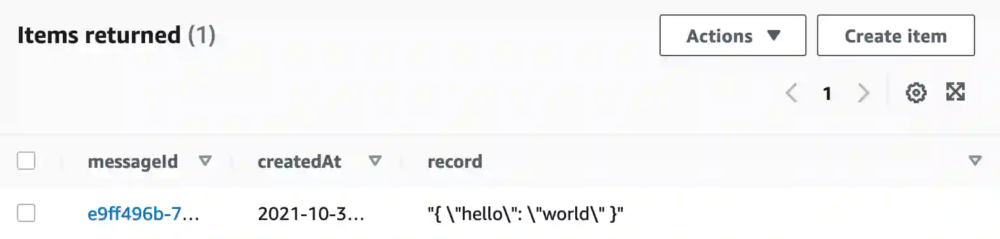

# IMPORTANT NOTE

This is a repository for a take home interview question I had in 2021. I have
removed screenshots with the company name, plus resources containing the
company name from this repository. History has also been removed to preserve
the company's anonymity. I was given around four hours to complete this
assignment. I worked on it all weekend (oops!). That said, they no longer
utilize this form of take home tests since I started working for them :)

# Overview

This repository contains a very simple automated AWS service deployed with
CodePipeline and Terraform. It contains two parts: A deployment automation, and
a serverless, RESTful web service.

(screenshot removed)

Structurally, the following primary folders are defined below:

```text
- /
  - config
  - terraform
  - scripts
  - lambda
```

1. `config` contains the build definitions plus all other app configurations.
1. `terraform` contains all of the terraform definitions.
1. `scripts` contains all standalone logic required for deployment.
1. `lambda` contains the logic of the function app.

There are several assumptions within this repository:

1. Though cloned on GitHub, this repository exists within my personal AWS environment in CodeCommit to simplify automation for the sake of this activity.
1. My AWS account already includes a CodeBuild policy used by automation. This policy includes a combination of other policies which are outlined below.
1. I've removed my account numbers from the checked in code and this README.
1. All secrets are managed with AWS Secrets Manager; these secrets are configured in the `buildspec.yaml` and passed to terraform in the `scripts/terraform` script: 
1. ~~I tried to create commits in logical order so that the [commit history](https://github.com/jgshort/interview0/commits/master) illustrates my general thought process.~~ This was relevent when I submitted for the job, but the repository has now been flattened.

# Bootstrap Steps: Establish Automation

Here are the steps I followed to setup a code pipeline for automated deployments
based on commits to the master branch of a new repository.

1. Init an empty git repository and add this README.md.
1. Create AWS git repository in CodeCommit: (screenshot removed)
1. Add S3 bucket for CodeBuild.
1. Create CodeBuild project: (sceenshot removed)
1. Bootstrap deployment.

At this point in the boostrap process, there now exists a CodeBuild project with
a `buildspec.yaml` that can be triggered manually. It would be nice, though, not
to manually trigger the build. To that end, I finalized the automation through
the following steps:

1. Add Terraform state lock table to terraform resources and configure Terraform with S3 plus state lock table options.
1. Add CodePipeline resource to auto-build commits.

At this stage, the pipeline is now 100% automated; infrastructure will deploy on
each successful `git push`.

# Defining the Service

The basic premise (time permitting) is to have an API endpoint that accepts a
JSON payload, places it on a queue, and returns a 202 response. Once on the
queue, a separate lambda will pick up the payload and save it to persistent
storage, in this case, DynamoDB.

Here are the steps, in order, I followed to establish the endpoints and
functional aspects of this service:

1. Create the `fakecompany-queue-data` and `fakecompany-persist-data` lambda stubs. (screenshot removed)
1. Create the queue to be fed from `queue-data` and read by `persist-data` plus a deadletter queue. (screenshot removed)
1. Set SQS permissions for both labmdas with policies. (screenshot removed)
1. Finalize the `fakecompany-queue-data` lambda, which will post an event to the `fakecompany-data` queue, returning a payload with the event and posted queue properties.
1. Add an API Gateway integration to the `fakecompany-queue-data` lambda.
1. Adjust the `fakecompany-queue-data` lambda to account for the format required by the API Gateway.
1. Finalize the `fakecompany-persist-data` lambda, which will listen to the `fakecompany-data` queue and save it to persistent storage.
1. Setup a CloudFront distribution in front of the API Gateway.
   

At this stage, everything is established. We can now post to the CloudFront-fronted API:

```bash
$ curl -X POST \
   -H "Content-Type: application/json" \
   -H "X-Auth-Token: my-very-secret-token" \
   -d '{ "hello": "world" }' \
   https://dnvpqnnm0q0c2.cloudfront.net/api/save | jq
```

This will save the `{ hello: "world" }` object to Dynamo:



Sample 202 response:

```json
{
  "ResponseMetadata": {
    "RequestId": "acdeb16f-4557-5fc6-935d-e897a387221e"
  },
  "MD5OfMessageBody": "07d031ca09ecdd2db304fe072e9bafb5",
  "MessageId": "8e017ab2-804d-4aee-9308-335ae97b8360",
  "body": "{ \"hello\": \"world\" }"
}
```

Sample 401 response:

```bash
$ curl -X POST \
   -H "Content-Type: application/json" \
   -H "X-Auth-Token: my-very-broken-token" \
   -d '{ "hello": "world" }' \
   https://dnvpqnnm0q0c2.cloudfront.net/api/save | jq
```

```json
{
  "errorType": "Unauthorized",
  "httpStatus": 401,
  "requestId": "a20ddca7-7636-437a-9622-4ae7e314939e"
}
```

# On Securing IAM

(This section has been removed from this repository as it contained interview-specific questions about the company in question).

# Policy Definitions

## Lambda/Queue Policies

The `persist` lambda has access to the `fakecompany-queue` (and `dlq`) to send, receive, and delete messages, while the `queue` lambda only has access to send messages.

For the `persist` lambda:

```json
{
    "Version": "2012-10-17",
    "Statement": [
        {
            "Effect": "Allow",
            "Action": [
                "sqs:SendMessage",
                "sqs:ReceiveMessage",
                "sqs:GetQueueAttributes",
                "sqs:DeleteMessage"
            ],
            "Resource": [
                "arn:aws:sqs:us-east-2:111111111111:fakecompany-data-dlq",
                "arn:aws:sqs:us-east-2:111111111111:fakecompany-data"
            ]
        }
    ]
}
```

For the `queue` lambda:

```json
{
    "Version": "2012-10-17",
    "Statement": [
        {
            "Effect": "Allow",
            "Action": "sqs:SendMessage",
            "Resource": "arn:aws:sqs:us-east-2:111111111111:fakecompany-data"
        }
    ]
}
```

## Lambda/Logging Policies

Both lambdas have access to CloudWatch:

```json
{
    "Version": "2012-10-17",
    "Statement": [
        {
            "Effect": "Allow",
            "Action": [
                "logs:PutLogEvents",
                "logs:CreateLogStream"
            ],
            "Resource": "arn:aws:logs:*:*:*"
        }
    ]
}
```

## Lambda/Dynamo Policies

Only the `persist` lambda has access to write to Dynamo:

```json
{
    "Version": "2012-10-17",
    "Statement": [
        {
            "Effect": "Allow",
            "Action": "dynamodb:PutItem",
            "Resource": "arn:aws:dynamodb:us-east-2:111111111111:table/fakecompany"
        }
    ]
}
```

## CodeBuild Automation Policies

The following policies allow CodeBuild to access CloudWatch and S3 for logging
and artifacts:

### CodeBuild to CloudWatch and S3

```json
{
    "Version": "2012-10-17",
    "Statement": [
        {
            "Effect": "Allow",
            "Resource": [
                "arn:aws:logs:us-east-2:111111111111:log-group:/aws/codebuild/fakecompany",
                "arn:aws:logs:us-east-2:111111111111:log-group:/aws/codebuild/fakecompany:*"
            ],
            "Action": [
                "logs:CreateLogGroup",
                "logs:CreateLogStream",
                "logs:PutLogEvents"
            ]
        },
        {
            "Effect": "Allow",
            "Resource": [
                "arn:aws:s3:::codepipeline-us-east-2-*"
            ],
            "Action": [
                "s3:PutObject",
                "s3:GetObject",
                "s3:GetObjectVersion",
                "s3:GetBucketAcl",
                "s3:GetBucketLocation"
            ]
        },
        {
            "Effect": "Allow",
            "Resource": [
                "arn:aws:codecommit:us-east-2:111111111111:fakecompany"
            ],
            "Action": [
                "codecommit:GitPull"
            ]
        },
        {
            "Effect": "Allow",
            "Resource": [
                "arn:aws:s3:::fakecompany-test-project",
                "arn:aws:s3:::fakecompany-test-project/*"
            ],
            "Action": [
                "s3:PutObject",
                "s3:GetBucketAcl",
                "s3:GetBucketLocation"
            ]
        },
        {
            "Effect": "Allow",
            "Action": [
                "codebuild:CreateReportGroup",
                "codebuild:CreateReport",
                "codebuild:UpdateReport",
                "codebuild:BatchPutTestCases",
                "codebuild:BatchPutCodeCoverages"
            ],
            "Resource": [
                "arn:aws:codebuild:us-east-2:111111111111:report-group/fakecompany-*"
            ]
        }
    ]
}
```

### CodeBuild to CloudWatch log streams

```json
{
    "Version": "2012-10-17",
    "Statement": [
        {
            "Effect": "Allow",
            "Resource": [
                "arn:aws:logs:us-east-2:111111111111:log-group:/aws/CodeBuild/fakecompany",
                "arn:aws:logs:us-east-2:111111111111:log-group:/aws/CodeBuild/fakecompany:*"
            ],
            "Action": [
                "logs:CreateLogGroup",
                "logs:CreateLogStream",
                "logs:PutLogEvents"
            ]
        }
    ]
}
```

### EventBridge to CodePipeline Trigger

```json
{
  "Version": "2012-10-17",
  "Statement": [
    {
      "Sid": "FakeCompanyCodePipelinePolicy",
      "Effect": "Allow",
      "Principal": {
        "Service": "events.amazonaws.com"
      },
      "Action": "sts:AssumeRole"
    }
  ]
}
```

# Defects and Lessons Learned

- Chose the wrong CodeBuild environment initially, selecting `ARM` instead of `x86`; this broke the terraform installation via `yum`.
- Made the mistake of not properly bootstrapping the terraform state lock table and had to import it for a single build.
- Did not gracefully handle workspace existence in the `terraform` script once state management was enabled.
- Early on, for the sake of time, I didn't add tests for the lambdas. As time went on and the project grew, I ended up regretting this decision.
- A typo on a policy (`dynamo:PutItem` vs `dynamodb:PutItem`) caused me more grief than it should have.
- I returned the wrong error status code (403 vs 401) on the POST endpoint and didn't notice until early 2021/11/03. Fixed.
- Spent more time than I should have on this project, but it was fun :)

# If I had more time, I'd...

1. Establish proper authentication/authorization at the API-level. It would interesting to create a Cognito (or other) service to validate requests and assert an authorization token.
1. Play around with different AWS storage options, such as Aurora or RDS.
1. Add tests for the Lambdas.
1. Really finalize the network aspect, with everything properly isolated across VPCs. Additionally, I included everything in the same AZ; in a real production environment, there'd be geographic replication of critical infrastructure which isn't present in this solution. I'm disappointed I didn't get to this.

# Thank You

Thank you so much for allowing me to participate. I sincerely appreciate it!

